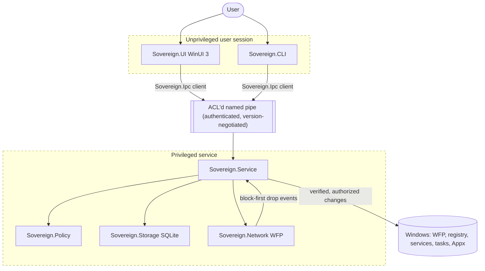

# Architecture

This document describes Sovereign's components, trust boundaries, and intended data flow. It
reflects the design mandated by [`agent_start.md`](../agent_start.md) sections 3 and 16.

> **Status note (through Milestone 2):** The service hosts authenticated local IPC over a secured
> named pipe, a local SQLite event and restore-point store, and a declarative policy engine that
> acts on a harmless in-memory sandbox provider. The CLI and a minimal WinUI 3 shell talk to it
> through a shared IPC client, and version negotiation is in place. No real registry, Appx, or
> network changes occur yet (real policy providers land in M5; network enforcement in M3). The UI
> is built via the `-Full` switch and is not in the default gate. This document describes the target
> design; where a piece is not yet implemented it is marked.

## Components

| Component | Process / form | Privilege | Status | Responsibility |
|-----------|----------------|-----------|--------|----------------|
| `Sovereign.UI` | WinUI 3 app (unpackaged, self-contained) | Unelevated | Minimal shell (M1b) | Dashboard, prompts, settings, history, notifications, update selection, rule editing, drift reports. Never mutates privileged state directly. |
| `Sovereign.Service` | Windows Service (`net10.0-windows`) | Minimum necessary (LocalSystem) | IPC + stores + policy engine (M2) | Applies policies, manages services/tasks/Appx/features, controls updates, maintains filters, verifies state. Exposes authenticated local IPC. |
| `Sovereign.Ipc` | Library | n/a | Implemented (M1+M2 ops) | Named-pipe framing, version negotiation, and the IPC client (read-only + policy list/detect/plan/apply/rollback) used by UI and CLI. References only `Sovereign.Contracts`. |
| `Sovereign.Network` | Native WFP component | In-service / system | Placeholder (M3) | Default-deny outbound filtering via Windows Filtering Platform; drop-event capture; block-first notification. No kernel driver in V1. |
| `Sovereign.Policy` | Library | n/a | Engine + demo policies (M2) | Declarative, idempotent, reversible, verifiable desired-state policies; the `PolicyEngine` orchestrates transactional apply/rollback over an `ISettingProvider` seam. Real providers in M5. |
| `Sovereign.Storage` | Library (SQLite) | n/a | Event + restore-point store (M2) | Local, versioned, append-only event/decision/audit storage and capture-before-change restore points. |
| `Sovereign.Contracts` | Library | n/a | Types + IPC DTOs | Shared, infrastructure-independent contracts (states, decisions, IPC + policy messages). |
| `Sovereign.CLI` | Console (`sov`) | Same as UI | diagnostics + `policy` commands | Local administration, diagnostics, export, emergency recovery via the same service API and authorization model. |

## Trust boundaries

The critical boundary is between the **unprivileged session** (UI/CLI) and the **privileged
service**. The service must validate, authenticate, and authorize every IPC request and must
never trust paths, hashes, publishers, PIDs, or service names supplied by the caller without
independent service-side verification (`agent_start.md` section 15.2).

## Data flow (intended)

1. The native WFP component blocks an unknown outbound connection (default deny) and emits a
   drop event with connection metadata.
2. The service receives the event, attributes it (executable, service, publisher, destination),
   records it in local storage, and queues a notification.
3. The UI presents the blocked attempt and the available decisions (keep blocked, allow once,
   allow until process exits, timed allow, allow for profile, permanent rule).
4. The user's choice returns to the service over authenticated IPC; the service installs the
   corresponding rule with an explicit lifetime and records the decision with its evidence.
5. If the UI is unavailable or a prompt times out, the connection stays blocked and the event
   is queued locally.

## Enforcement lifecycle (intended)

- **Startup:** the service loads the last committed enforcement state before any traffic is
  permitted. A restart must not create an unrestricted interval.
- **Steady state:** rules are evaluated deterministically; temporary rules expire closed; drift
  is detected against desired state.
- **Shutdown/upgrade:** enforcement state is preserved; reboot resumes the committed state.
- **Emergency recovery:** a local, documented, authenticated path can restore normal
  networking without creating a permanent bypass (see `scripts/restore-network.ps1`).

## IPC model (Milestone 1 reality)

`Sovereign.Service` runs as a Windows service (or a console process in development) and exposes a
single named pipe, `\\.\pipe\Sovereign.Ipc`, created with an explicit ACL via
`NamedPipeServerStreamAcl.Create` (see [ADR 0002](decisions/0002-local-ipc-over-secured-named-pipes.md)
and the [named-pipe security research](research/2026-06-24-named-pipe-ipc-security.md)):

- LocalSystem and Administrators get full control; the interactive user gets read/write only
  (never `CreateNewInstance`); Everyone/Anonymous get nothing. The account the server runs under is
  also granted control of its own pipe so it can create additional instances.
- Each connection negotiates a protocol version (`Hello`); no common version fails closed.
- Every operation passes an explicit authorization allow-list. Milestone 2 adds policy operations:
  read-only `ListPolicies`/`DetectPolicy`/`PlanPolicy` and the first **mutating** operations,
  `ApplyPolicy`/`RollbackPolicy`. Mutating operations stay behind the same ACL'd pipe and are
  audited with the caller's Windows identity. Decisions never rely on the spoofable client PID.
- Framing is length-prefixed JSON with a hard size bound (local DoS guard).

`Sovereign.Storage` provides the local SQLite event store and restore-point store (events are
versioned via `PRAGMA user_version`; both tables are created on startup). Committed events and
restore points persist across service restarts.

## Policy engine (Milestone 2 reality)

`Sovereign.Policy` implements a declarative, setting-based engine
([ADR 0004](decisions/0004-declarative-setting-based-policy-engine.md)). A policy is metadata plus a
list of desired settings; the `PolicyEngine` derives all behavior generically against an
`ISettingProvider`:

- **Detect/Plan:** compare current vs desired. All match -> `Compliant`; any differ ->
  `NonCompliant`; a provider read failure -> `Unknown`; unsupported -> `Unsupported`. `Unknown` and
  `Unsupported` are never treated as compliant.
- **Apply (transactional, capture-before-change):** snapshot each target's original value, persist a
  restore point, apply each change, verify each change and then the whole policy independently. On
  any failure, restore every captured value and verify the restore. Success -> `Applied`; a verify
  failure that was rolled back -> `VerificationFailed`; a failed rollback -> `RollbackFailed`. Apply
  is idempotent: an already-compliant policy is a no-op that reports `Compliant`.
- **Rollback:** restore the latest persisted restore point and verify.

In Milestone 2 the only provider is a harmless in-memory sandbox (`InMemorySettingProvider`), so no
real machine state changes. Real registry/Appx providers arrive in Milestone 5 behind the same
`ISettingProvider` seam, reusing the engine and its tests unchanged.
