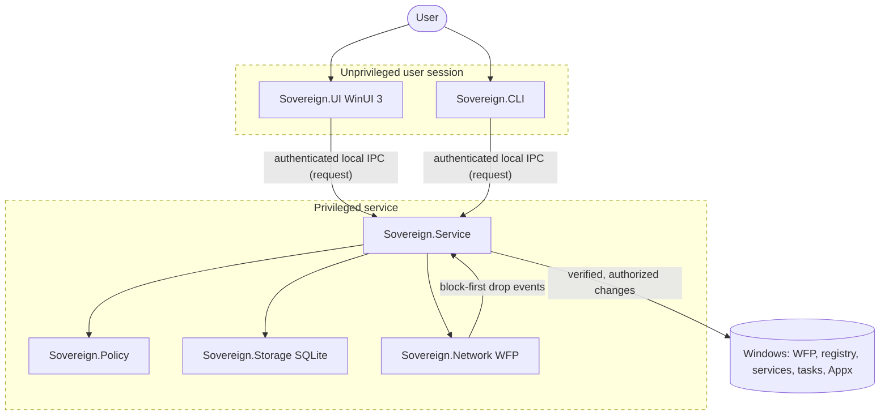

# Architecture

This document describes Sovereign's components, trust boundaries, and intended data flow. It
reflects the design mandated by [`agent_start.md`](../agent_start.md) sections 3 and 16.

> **Milestone 0 note:** Only the managed component boundaries exist today, and they perform no
> privileged work. The UI and native networking components are documented placeholders. This
> document describes the target design; where a piece is not yet implemented it is marked.

## Components

| Component | Process / form | Privilege | Status (M0) | Responsibility |
|-----------|----------------|-----------|-------------|----------------|
| `Sovereign.UI` | WinUI 3 app | Unelevated | Placeholder (M1) | Dashboard, prompts, settings, history, notifications, update selection, rule editing, drift reports. Never mutates privileged state directly. |
| `Sovereign.Service` | Windows Service | Minimum necessary | No-op host | Applies policies, manages services/tasks/Appx/features, controls updates, maintains filters, verifies state. Exposes authenticated local IPC. |
| `Sovereign.Network` | Native WFP component | In-service / system | Placeholder (M3) | Default-deny outbound filtering via Windows Filtering Platform; drop-event capture; block-first notification. No kernel driver in V1. |
| `Sovereign.Policy` | Library | n/a | Contract only | Declarative, idempotent, reversible, verifiable desired-state policies. |
| `Sovereign.Storage` | Library (SQLite) | n/a | Contract only | Local, versioned, append-only event/decision/audit storage. |
| `Sovereign.Contracts` | Library | n/a | Minimal types | Shared, infrastructure-independent contracts (states, decisions). |
| `Sovereign.CLI` | Console (`sov`) | Same as UI | Help/version only | Local administration, diagnostics, export, emergency recovery via the same service API and authorization model. |

## Trust boundaries

The critical boundary is between the **unprivileged session** (UI/CLI) and the **privileged
service**. The service must validate, authenticate, and authorize every IPC request and must
never trust paths, hashes, publishers, PIDs, or service names supplied by the caller without
independent service-side verification (`agent_start.md` section 15.2).

## Data flow (intended)

1. The native WFP component blocks an unknown outbound connection (default deny) and emits a
   drop event with connection metadata.
2. The service receives the event, attributes it (executable, service, publisher, destination),
   records it in local storage, and queues a notification.
3. The UI presents the blocked attempt and the available decisions (keep blocked, allow once,
   allow until process exits, timed allow, allow for profile, permanent rule).
4. The user's choice returns to the service over authenticated IPC; the service installs the
   corresponding rule with an explicit lifetime and records the decision with its evidence.
5. If the UI is unavailable or a prompt times out, the connection stays blocked and the event
   is queued locally.

## Enforcement lifecycle (intended)

- **Startup:** the service loads the last committed enforcement state before any traffic is
  permitted. A restart must not create an unrestricted interval.
- **Steady state:** rules are evaluated deterministically; temporary rules expire closed; drift
  is detected against desired state.
- **Shutdown/upgrade:** enforcement state is preserved; reboot resumes the committed state.
- **Emergency recovery:** a local, documented, authenticated path can restore normal
  networking without creating a permanent bypass (see `scripts/restore-network.ps1`).

## Startup and shutdown (Milestone 0 reality)

Today `Sovereign.Service` builds a generic host with a no-op background worker that logs that
the scaffold is running and idles until shutdown. It installs nothing and enforces nothing.
