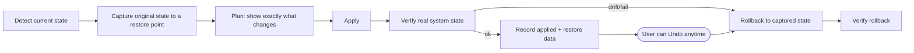

# Reversibility Model

"Anything we do should be un-doable." This document defines how Sovereign guarantees that, and
where the honest limits are. It implements the system-change invariants in
[`agent_start.md`](../agent_start.md) section 2.3 and the policy contract in section 8
(`Detect / Plan / Apply / Verify / Repair / Rollback`).

> Core rule: **capture the original state before changing it, and never permanently delete state
> when disabling or preserving it is sufficient.** A change is not "done" until its rollback path
> is recorded and (where feasible) tested.

## The reversible-operation lifecycle

Every managed change is a transaction with recorded evidence:

- If a multi-step change fails partway: stop, record the failed step, preserve evidence, roll
  back completed steps when safe, verify the rollback, and report residual drift. Never mark it
  compliant (section 8).
- Restore data is stored locally (the SQLite store) and is itself part of the audit trail.

## Restore points

Before a batch of changes (e.g. applying a profile or a debloat selection), Sovereign creates a
**restore point**: a named, timestamped bundle of the captured original state for every item in
the batch, plus the actor and reason. The UI shows restore points and offers one-click
"Revert this change" and "Revert everything in this batch."

Sovereign's own restore points are independent of (and complementary to) Windows System
Restore; Sovereign does not rely on Windows System Restore being enabled.

## Per-category capture and restore

| Category | What is captured before change | How it is undone | Reversibility |
|----------|--------------------------------|------------------|---------------|
| Registry policy value | Exact prior value and type, or the fact that it was **absent** | Re-write the prior value, or delete the value if it was absent | Full |
| Local Group Policy | Prior policy state / backing registry values | Restore prior state | Full |
| Service configuration | Prior `StartType` and current status | Restore start type; start/stop to prior status | Full |
| Scheduled task | Prior enabled/disabled state (and definition if modified) | Re-enable / restore definition | Full |
| Optional feature / capability | Whether it was enabled/installed | `Enable-WindowsOptionalFeature` / `Add-WindowsCapability` | Full (may need servicing source) |
| Appx per-user package | `PackageFullName`, install state | `Add-AppxPackage` (re-register) or Store reinstall | Usually full |
| Appx provisioned package | `PackageName`; original package files + license **if retained** | `Add-AppxProvisionedPackage` from retained files, else Store reinstall | Conditional (see below) |
| AppLocker rule (e.g. Copilot) | Prior ruleset | Remove the rule / restore prior ruleset | Full |
| Firewall / WFP filter | Prior filter set / committed enforcement state | Remove Sovereign filters; restore prior state (`scripts/restore-network.ps1`) | Full |
| File permission / protocol handler / startup entry | Prior ACL / handler / entry | Restore recorded prior value | Full |

## Capturing "absent" correctly

The most common rollback bug is treating a deleted-on-undo value as "set to 0/default." Sovereign
distinguishes three prior states for any value: **present-with-value-X**, **present-but-empty**,
and **absent**. Undo restores the exact prior tri-state. This is unit-tested at the policy layer
(see `docs/test-strategy.md`).

## Honest limits (flagged, not hidden)

Some operations cannot be guaranteed reversible from local state alone. Sovereign **flags** these
and requires explicit confirmation that states the consequence plainly:

- **Provisioned package removal without retained files.** If Microsoft does not offer the package
  in the Store and Sovereign did not retain the original `.appx`/license, full offline restore is
  not guaranteed. Mitigation under consideration (ADR candidate): optionally retain a local copy
  of original provisioned package files before removal so restore is always possible.
- **Servicing-driven changes.** A Windows cumulative update can re-provision packages or reset
  policy. This is drift, not a Sovereign failure; drift detection reports it and offers repair.
- **Per-user vs machine scope.** Removing a provisioned package does not uninstall it for existing
  users, and vice versa; Sovereign records and undoes both scopes explicitly.

## What this requires of the implementation

- The policy engine captures original state in `Detect`/`Plan` and persists it before `Apply`.
- `Rollback` restores from the captured state and is itself verified.
- Verification checks real system state, never just a command exit code (section 2.3).
- Rollback failure is a first-class result (`RollbackFailed`) and is never reported as compliant.
- Tests cover normal, failure, and rollback paths, including the absent-value tri-state and
  partial-apply rollback (`docs/test-strategy.md`, failure-injection tier).
